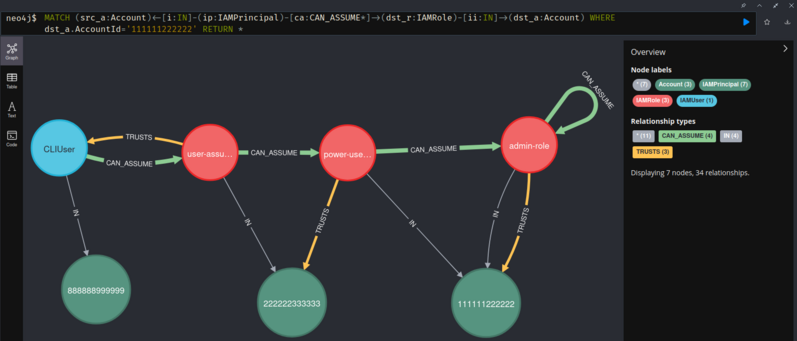

# IAMGraph

Tool to model AWS IAM role trust relationships and assume role paths to Neo4j graph database. The tool has been built to help in analysing IAM role trust relationships between multiple AWS accounts. It relies heavily on [Neo4j](https://neo4j.com/) to model and visualize the IAM resources and their interconnections and [IAMSpy](https://github.com/WithSecureLabs/IAMSpy/) to evaluate IAM permissions.




IAMGraph works with the output of AWS CLI command `aws iam get-account-authorization-details` - access to target AWS accounts with permissions to run this command is needed.

**Note:** Sometimes files generated by the `aws iam get-account-authorization-details` might miss some required data causing IAMSpy failing to load them. For example, when using permission boundaries, managed policies may not be included in the returned data if they are used by boundaries but nothing else. If IAMSpy fails to load some input data, analysis of these accounts is skipped.

## Installation

### Neo4j
Neo4j database needs to be running and reachable. Neo4j has community edition available as [Docker image](https://hub.docker.com/_/neo4j/). For running the db locally, authentication can be disabled by passing `-e NEO4J_AUTH=none` environment variable to the container. If database authentication is configured, the database user needs to be passed to IAMGraph with `--db-user` flag and it will prompt for database password.

For example, run Neo4j with podman/docker:
```
podman pull docker.io/library/neo4j:latest
podman run \
    -d -p 127.0.0.1:7474:7474 -p 127.0.0.1:7687:7687 \
    -e NEO4J_AUTH=none \
    -v $PWD/data:/data \
    neo4j:latest
```

### Install IAMGraph

Clone the repository and install either:

with [Poetry](https://python-poetry.org/docs/): `poetry install`

OR

with pip: `pip install .`

## Usage

1. Collect the needed IAM data by running `aws iam get-account-authorization-details` on every target account and store its output to a directory:
    ```
    aws iam get-account-authorization-details --profile account-1 > ./input/account1.json
    aws iam get-account-authorization-details --profile account-2 > ./input/account2.json
    ...
    aws iam get-account-authorization-details --profile account-n > ./input/accountn.json
    ```

2. Ensure Neo4j database is running and reachable

3. Run the tool. Give it the database endpoint and directory where the IAM data is stored as arguments:
    ```
    iamgraph run --db-uri bolt://localhost:7687 run --input-dir ./input/
    ```
    The individual stages (model and analyse) can also be run separaterly. See `iamgraph help` for details.

4. Navigate the Neo4j browser UI. With default configuration it is in: http://localhost:7474/browser/

5. Execute [Cypher](https://neo4j.com/docs/cypher-manual/current/introduction/) queries in the browser UI to find interesting trust relationships and access paths. Some example queries and the data schema are described below.


## Example Queries

Return all nodes and relationships in the database. With smaller datasets this can be used to explore the data. With larger datasets there will be too many nodes and relationships to show on the UI and more detailed queries are needed.

```
MATCH (n)-[r]-() RETURN *
```
Return roles that trust entities not part of the input dataset. If the input data contains data from all accounts of the organization, this helps to find roles that could potentially be assumed from outside the organization.

```
MATCH (a)<-[t:TRUSTS]-(r) WHERE a.InDataset=false RETURN *
```
Return all assume-role paths in the db. Note that with large datasets this can be too large to be shown in the Neo4j browser UI.
```
MATCH (src_a:Account)<-[i:IN]-(src_p:IAMPrincipal)-[ca:CAN_ASSUME]->(dst_r:IAMRole)-[ii:IN]->(dst_a:Account) RETURN *
```
Same as above, but limit the target account with the `WHERE` clause.
```
MATCH (src_a:Account)<-[i:IN]-(src_p:IAMPrincipal)-[ca:CAN_ASSUME*]->(dst_r:IAMRole)-[ii:IN]->(dst_a:Account) WHERE dst_a.AccountId='111111222222' RETURN *
```
Return roles trusting wildcard (`"*"`) principal:
```
MATCH (p:IAMPrincipal {ARN:'*'})<-[t:TRUSTS]-(n) RETURN *
```
Return roles trusting identity providers:
```
MATCH (r:IAMRole)-[t:TRUSTS]->(i:IdentityProvider) RETURN *
```


## Schema

Below are described the types of nodes and relationships IAMGraph generates to the database. This helps in crafting the Cypher queries to explore the generated model.

### Relationships

IAMUser and IAMRole nodes that are part of the input dataset are all `IN` an Account
```
(IAMUser:IAMPrincipal)-[IN]->(Account)
(IAMRole:IAMPrincipal)-[IN]->(Account)
```
Depending on the dataset, there might be IAMUser and IAMRole nodes not `IN` an account. This happens if a role trusts a principal not part of the dataset. Then, a node representing this external principal is created, but it's not `IN` any account.

When IAM principal or account is defined in role's trust policy, the `IAMRole` node `TRUSTS` the principal. The `TRUST` relationships are created based on the parsed trust policies.
```
(IAMRole)-[TRUSTS]->(Account)
(IAMRole)-[TRUSTS]->(IAMUser)
(IAMRole)-[TRUSTS]->(IAMRole)
(IAMRole)-[TRUSTS]->(IAMPrincipal)
(IAMRole)-[TRUSTS]->(IdentityProvider)
```

IAM role and user `CAN_ASSUME` a role if they can effectively assume it. `CAN_ASSUME` relationships are created based on analysis with IAMSpy which evaluates all the relevant policies affecting whether a principal can assume the role.
```
(IAMRole)-[CAN_ASSUME]->(IAMRole)
(IAMUser)-[CAN_ASSUME]->(IAMRole)
```

### Nodes

`Account`\
Properites of Account node:
- **ARN**
- **InDataset** - Accounts that have been part of the input data set
- **AccountId** - AWS Account id of the account

`IAMUser`\
Properties of IAMUser node:
- **ARN**
- **InDataset**
- **Path**
- **Name**
- **UniqueID**
- **InlinePolicies**
- **ManagedPolicies**
- **Groups**
- **Tags**
- **AccountId**

`IAMRole`\
Properties of IAMRole node:
- **ARN**
- **InDataset**
- **Path**
- **Name**
- **UniqueID**
- **TrustPolicy**
- **ManagedPolicies**
- **InlinePolicies**
- **Tags**
- **LastUsed**
- **IsInstanceProfile**
- **AccountId**

`IdentityProvider`\
Properties of IdentityProvider node:
- **ARN**

`IAMPrincipal`\
Represents an IAM principal. All `Account`, `IAMUser` and `IAMRole` nodes have also this label. Also the wildcard principal (\*) is represented with IAMPrincipal node where ARN property of the node is "\*".


## How It Works?

When IAMGraph is executed, it does the following:

1. **Model** - The input IAM data is modelled as a graph.
    1. Node representing every account, IAM user and role in the dataset is created.
    2. Roles' trust policies are parsed to identify roles that trust an IAM principal, account or
    3. From each such role, a `TRUSTS` relationship is created to the node it trusts. If the trusted node does not already exist in the database, the trusted principal was not part of the input dataset, and it is created. For such node, the `InDataset` property is set to `false`.
2. **Analyse** - After the input data is modelled to the database, the resulting graph is analysed with IAMSpy for effective assume-role paths
    1. The graph model is queried for roles whose trust policy allows IAM principal or an account to assume the role
    2. If the role trusts a whole account, IAMSpy is used to find principals in the trusted account that can assume the role. If the role trusts a user or role, IAMSpy is used to ensure the trusted principal can assume the role.
    3. `CAN_ASSUME` relationship is created between principals and the roles they could effectively assume
